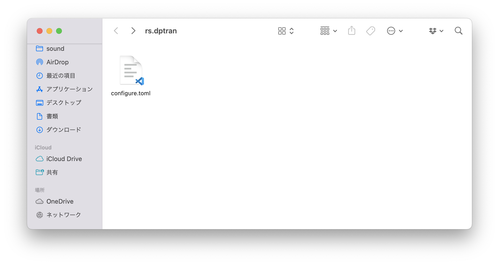

CLI ツールを開発していると、設定ファイルの管理という面倒な問題に直面してしまいます。  
何が面倒かというと、JSON とか xml とか toml のシリアライズ・デシリアライズも面倒なんですが、OS によって各 CLI ツールが扱うファイルを置くための場所が変わってしまうのが何より面倒。  

例を挙げると、  

- Windows なら``C:\\Users\[ユーザ名]\AppData\[アプリ名]``
- Mac なら``~/Library/Preferences/[アプリ名]``
- Linux なら``/etc/[アプリ名]``

などなど…  

実行ファイルと同じ場所に設定ファイル置いておいてもいいんですが、環境によっては本来置くべき場所とは違う場所（例えば bash の参照ディレクトリとか）に置くことになってしまう場合も考えられるので微妙だし、相対パスが使えない（端末のカレントディレクトリが参照されるため）。  
そんな中、それらを自動でやってくれるクレートがあったので、ブログ更新回数稼ぎを兼ねてメモ。

<!--more-->  

# confy

参照：[confy - Rust](https://docs.rs/confy/latest/confy/){:target="_blank"}  

設定ファイルの管理をやってくれるクレート。  

OS や環境固有のファイルパスを事前に取得し、そこに設定ファイルを読み書きしてくれます。  
それだけでなく、設定ファイルのシリアライズ / デシリアライズ（ファイルとデータとの間の変換）もやってくれます。

# 例

自作の Rust 製 CLI ツール「dptran」を例に示します。設定ファイルがこんな感じ。

```toml
api_key = '<APIキー>'
default_target_language = 'JA'
```

内容としては、DeepL API の API キーと、既定の翻訳先言語コードの2つ。  
これを confy 用に構造体に示すと、こう。

```rust
use std::io;
use serde::{Deserialize, Serialize};
use confy;
use confy::ConfyError;

#[derive(Serialize, Deserialize, Debug)]
pub struct Configure {
    pub api_key: String,
    pub default_target_language: String
}
impl Default for Configure {
    fn default() -> Self {
        Self {
            api_key: String::new(),
            default_target_language: "JA".to_string()
        }
    }
}
```

``Configure``が設定ファイルの構造体。  
ここで、``Configure``に対し Default を指定しておくことで、設定ファイルが初めて作成されたとき、ここに定義した初期値が設定ファイルにも適用されます。  

## 設定の読み込み

```rust
pub fn get_settings() -> Result<Configure, ConfyError> {
    confy::load::<Configure>("dptran", "configure")
}
```

``confy::load()``で読み込み。引数が2つあり、1つ目はアプリ名、2つ目は設定ファイル名を指定します。  
アプリ内に設定ファイル名が1つだけの場合は None を指定しておくこともできます。

## 設定の書き込み

```rust
/// APIキーの設定  
/// 設定ファイルにAPIキーを設定する
pub fn set_apikey(api_key: String) -> Result<(), ConfyError> {
    let mut settings = get_settings()?;
    settings.api_key = api_key;
    confy::store("dptran", "configure", settings)?;
    Ok(())
}

/// デフォルトの翻訳先言語の設定  
/// 設定ファイルにデフォルトの翻訳先言語を設定する
pub fn set_default_target_language(default_target_language: String) -> Result<(), ConfyError> {
    let mut settings = get_settings()?;
    settings.default_target_language = default_target_language;
    confy::store("dptran", "configure", settings)?;
    Ok(())
}
```

`` confy::store()``で書き込み。引数はそれぞれ、アプリ名、設定ファイル名、設定変更後の``Configure``構造体の3つ。  
上記の例では、あらかじめ``settings``に現在の設定を読み込んでおき、設定変更したい項目を更新してから`` confy::store()``で設定を上書きしています。

## 設定の初期化

```rust
/// 設定の初期化
pub fn clear_settings() -> Result<(), ConfyError> {
    let settings = Configure::default();
    confy::store("dptran", "configure", settings)?;
    Ok(())
}
```

``default()``を呼び出すことで初期値を取得し、これに上書き。

## 設定ファイルの保存先

  
Mac の場合は``~/Library/Preferences/rs.<アプリ名>/<設定ファイル名>.toml``の中に保存されていました。toml がデフォルトの保存形式のようですね。
