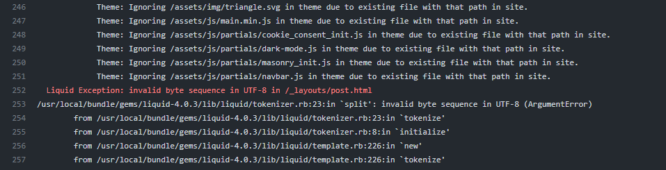
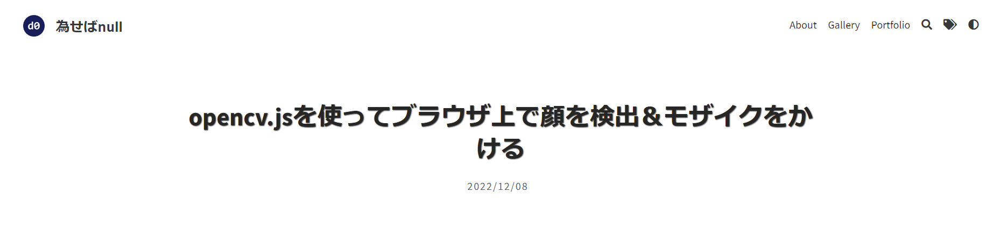

このブログ、使用している [Type-on-Strap](https://github.com/sylhare/Type-on-Strap){:target="_blank"} というテーマの仕様上、「Month DD, YYYY（例：December 10, 2022）」というアメリカ方式の日付表示でした。  

  

長らくこのままだったんですが、日本語流に「YYYY/MM/DD」という表記にローカライズできないかなと思い、今回変更させてみました。

<!--more-->

# ソースコードを辿る

どこで設定されているのか探るため、まずは Jekyll が生成した記事ページの HTML を眺めてみます。日付が書かれているのはここ。

```html
<div class="post-info">
    <p class="meta">
      
      
      December 08, 2022
    </p></div>

      
    </div>
  </header>
```

``post-info``の``meta``に直接書き込まれている様子でした。次に、GitHub でリポジトリを検索し、``post-info``の内容を設定しているであろうファイルを探します。  

``post_info.html``というファイルがありました。おそらくこれです。

```html

{% assign date = include.date | default: "today" | date: "%B %-d, %Y" %}

<div class="post-info">
  <a href="{{ author.url | relative_url }}" target="_blank">
    
      
    
    <p class="meta">
      {{ author.name }} - 
      {% assign x = date | date: "%m" | minus: 1 %}
      {{ site.data.language.str_months[x] | default: date | date: "%B" }} {{ date | date: "%d, %Y" }}
    </p>
  </a>
</div>
```

このソースコードから、``str_months[]``という配列に月の表記（January, February, March, ...）が書き込まれているものと思われます。  
str_months[] を設定したファイルがこちらの``language.yml``。

```yaml
# Localization strings
str_follow_on: "Follow on"
str_rss_follow: "Follow RSS feed"
str_share_on: "Share on"
str_add_to: "Add to"
str_email: "Email"
str_tweet: "Tweet"
str_pin_it: "Pin it"
str_next_post: "Next post"
str_previous_post: "Previous post"
str_next_page: "Next"
str_previous_page: "Prev"
str_javascript_required_disqus: "Please enable JavaScript to view comments."
str_no_result_found: "No result found"
str_cookie_approve: "Approve"
str_cookie_disclaimer: "We would like to use third party cookies and scripts to improve the functionality of this website."
str_months: [January, February, March, April, May, June, July, August, September, October, November, December]
```

これを以下のように書き換えました。

```yaml
# Localization strings
str_follow_on: "Follow on"
str_rss_follow: "Follow RSS feed"
str_share_on: "Share on"
str_add_to: "Add to"
str_email: "Email"
str_tweet: "Tweet"
str_pin_it: "Pin it"
str_next_post: "Next post"
str_previous_post: "Previous post"
str_next_page: "Next"
str_previous_page: "Prev"
str_javascript_required_disqus: "Please enable JavaScript to view comments."
str_no_result_found: "No result found"
str_cookie_approve: "Approve"
str_cookie_disclaimer: "We would like to use third party cookies and scripts to improve the functionality of this website."
str_months: [1, 2, 3, 4, 5, 6, 7, 8, 9, 10, 11, 12]
```


これでよし、とデプロイしてみると…    

    

わぁ、全記事の日付が January になっちゃった！  
おかしいな…

# issue を見てみる

Type-on-Strap の issue を見てみると、こんなことが書いてありました。  
[Add date localization formating in config.yml #241](https://github.com/sylhare/Type-on-Strap/pull/241){:target="_blank"}


```
There are different shorthand formats you can use:

%Y: Year with century, if provided, will pad result at least 4 digits, e.g. 0000, 0001, 1995, 2009, 14292
%C: year /100 (rounded down such as 20 in 2009)
%y: year % 100 (00 ... 99)
%m: Month of the year, zero padded (01 ... 12)
%_m: blank-padded ( 1 ... 12)
%-m: no-padded (1 ... 12)
%B: Full month name (January)
%b: The abbreviated month name (Jan)
%h: Equivalent to %b
%d: Day of the month, zero padded (01 ... 31)
%-d: no padded (1 ... 31)
%e: Day of the month, blank padded ( 1 ... 31)
%j: Day of the Year (001 ... 366)
%A: Full day of the week (Sunday)
%a: Abbreviated day of the week (Sun)
%D: Date (Short for '%M/%d/%y')
%F: The ISO 8601 date format '%Y-%m-%d'
```

なるほど、%うんたらが日付表記形式を決定づけているわけか。  
で、もう一度``post_info.html``を見てみると、

```html
{{ site.data.language.str_months[x] | default: date | date: "%B" }} {{ date | date: "%d, %Y" }}
```

``date: "%B"``の表記が。犯人はこいつかぁ。  
要は、``%B``としておくと January, February, March, ..., December という英語風の表記になってしまうようです。  
``default: date | date: "%B"``となっているので、先程変更した``str_months[]``の設定は使用されていなかったっぽいですね。  

issue の書き込みによると、``%m``で padding なしの数値での01～12表記になるので、これを採用。  

じゃあ、「YYYY年MM月DD日」という表記にしようと、以下のように修正。

```html
{{ date | date: "%Y年" }}{{ site.data.language.str_months[x] | default: date | date: "%m月" }}{{ date | date: "%d日" }}
```

ところが、GitHub Actions でのビルド時にエラーが発生。  

  

うーむ、マルチバイト文字を含んでいるとダメっぽい。  

仕方ないので、「YYYY年MM月DD日」ではなく「YYYY/MM/DD」という表記に修正しました。

```html
{{ date | date: "%Y/" }}{{ site.data.language.str_months[x] | default: date | date: "%m/" }}{{ date | date: "%d" }}
```

これでデプロイしてみると、  

  

やった！  
てなわけで、ようやく日本式の日付表記に修正できました。


