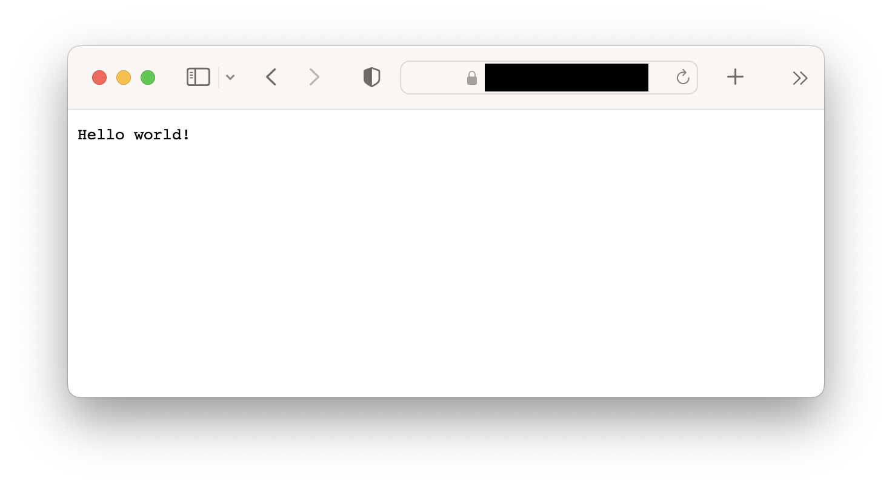
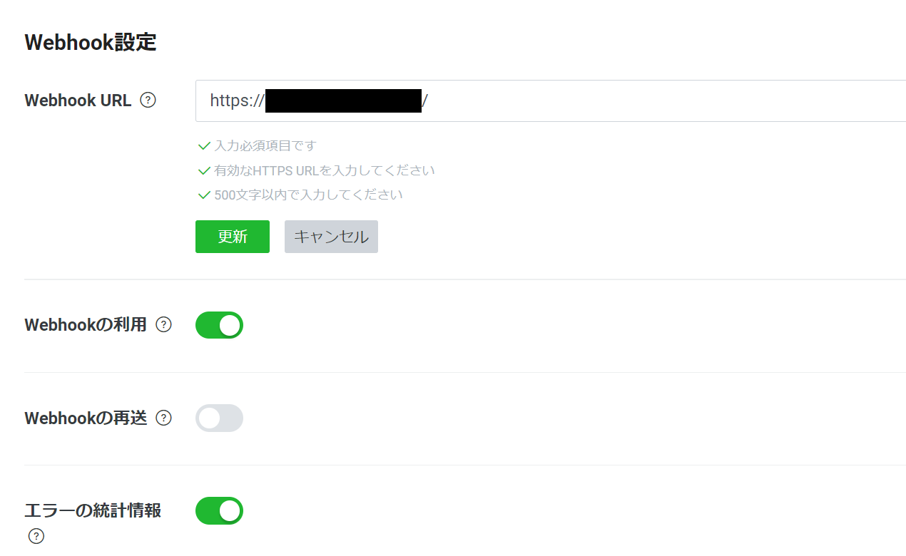
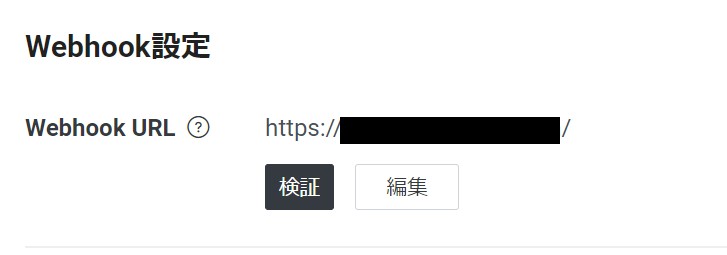
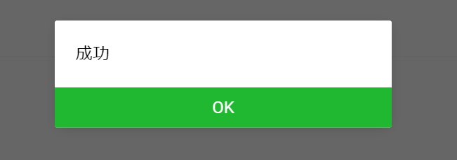
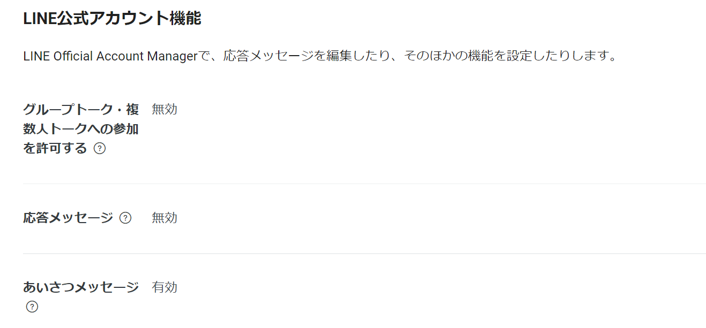
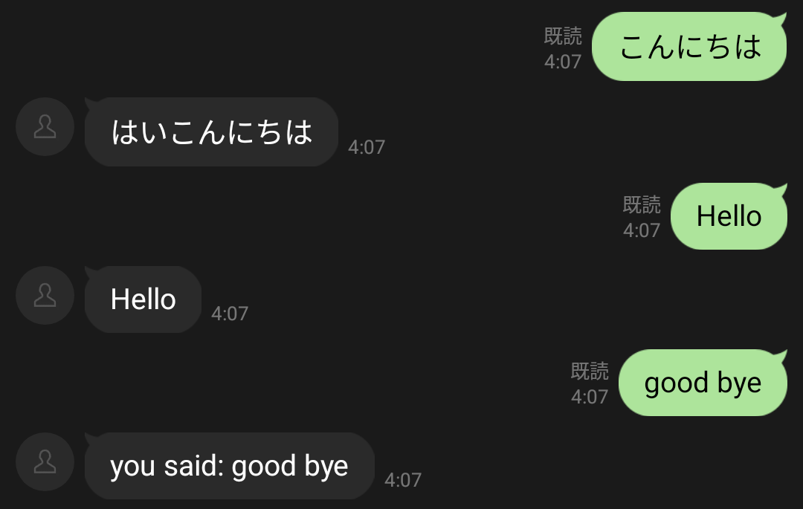
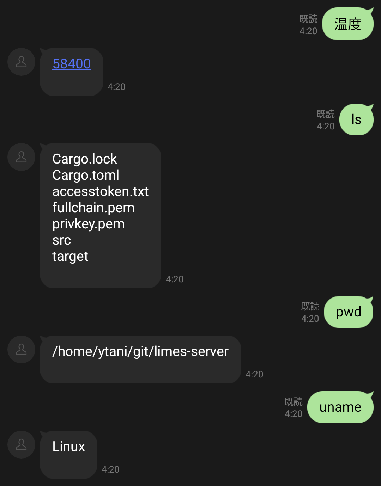

本シリーズでは、LINE Messaging API を利用して手元のマシンから簡単にメッセージを送受信する方法についてまとめています。

- [LINE Messaging API #1 Rustで簡単なLINEメッセージ送信ツールを作る](../../../2024/09/23/mes.html)
- [自宅サーバ用にSSL/TLS証明書を発行した](../../../2024/10/16/server-tls.html)
- LINE Messaging API #2 Rustとwebhookで簡単なLINE botを作る　　　　← 今回

#1 では webhook は使わずに、自発的なプッシュメッセージとして LINE メッセージをコマンドラインから送信するツールを Rust で作成しました。

2番目の記事「自宅サーバ用にSSL/TLS証明書を発行した」では、今回作成する webhook サーバの前準備として、サーバの証明書を作成しました（**LINE では、webhook は HTTPS 通信が前提となっています。まだサーバの証明書の作成をしていない方は、先に用意しておいてください**）。

そして今回は、ついに webhook を利用して LINE bot サーバを Rust で作成していきます。最終的には bot に送られたメッセージに対して定型文を返したり、サーバに Linux コマンドを実行させたりします。

<!--more-->

# この記事の想定

- 最終目標：自宅サーバで LINE bot サーバを組み、テキストメッセージに対して定型文を返せるようにする
- 読者対象：Messaging API の Webhook を利用して bot サーバを立てたい人 

# サーバの概要

- Raspberry Pi 5
  - OS : Ubuntu 23.10 (Linux kernel ver.6.5.0, 64bit)
  - CPU : BCM2835
  - RAM : 8GB

# 今回使う Web フレームワーク

HTTPS サーバを作成しますので、Web フレームワークが必要になります。

今回は人気で使いやすそうな [Actix Web](https://actix.rs){:target="_blank"} を採用しました。HTTPS にも対応しており、SSL/TLS 証明書のパスを指定することでセキュアな通信が可能になります。

# 実装順序の概要

下記の流れで作っていきます。

1. サーバアプリの雛形を作る
2. Messaging API で使う JSON データ用の構造体を定義する
3. メッセージに対する返答の定義、返信メッセージの送信処理の実装

# 1. サーバアプリの雛形を作る

Actix Web で簡単な HTTPS サーバアプリを作成します。

ここ ↓ を参考にしました。

- [HTTP/2 \| Actix Web](https://actix.rs/docs/http2/){:target="_blank"}

SSL/TLS 証明書は[前回の記事]で Let's Encrypt の certbot で作成したものを利用します。今回は certbot が配置したファイルパス（``/etc/letsencrypt/live/..``）から直接読み込んでいます。

また、ブラウザで動作確認するため get メソッドとして実装しています（後ほど webhook サーバを実装する際に post メソッドに変更する必要があります）。

```rust
use std::fs::File;
use std::io::BufReader;
use actix_web::{get, web, App, HttpServer, Responder, HttpResponse};

#[get("/")]
async fn index() -> impl Responder {
    HttpResponse::Ok().body("Hello world!")
}

#[actix_web::main]
async fn main() -> std::io::Result<()> {
    rustls::crypto::aws_lc_rs::default_provider()
        .install_default()
        .unwrap();

    let mut certs_file = BufReader::new(File::open("/etc/letsencrypt/live/[サーバ URL]/fullchain.pem").unwrap());
    let mut key_file = BufReader::new(File::open("/etc/letsencrypt/live/[サーバ URL]/privkey.pem").unwrap());

    let tls_certs = rustls_pemfile::certs(&mut certs_file)
        .collect::<Result<Vec<_>, _>>()
        .unwrap();
    let tls_key = rustls_pemfile::pkcs8_private_keys(&mut key_file)
        .next()
        .unwrap()
        .unwrap();

    // set up TLS config options
    let tls_config = rustls::ServerConfig::builder()
        .with_no_client_auth()
        .with_single_cert(tls_certs, rustls::pki_types::PrivateKeyDer::Pkcs8(tls_key))
        .unwrap();

    HttpServer::new(|| {
            App::new()
                .service(index)
        })
        .bind_rustls_0_23(("0.0.0.0", 443), tls_config)?
        .run()
        .await
}

```

## 実行時の注意

Linux の場合、443 ポートで実行するには root 権限が必要になります。

また、certbot が生成したサーバ証明書は、デフォルトの状態では非 root user からの read アクセスが許可されていません。root 権限でサーバアプリを実行する場合は不要ですが、ユーザ権限で実行したい場合は注意してください。

## 実行結果

https://[サーバ URL]/ にアクセスしてみます。



Hello World! と表示され、サーバへのアクセスの成功が確認できました。

# 2. Messaging API で使う JSON データ用の構造体を定義する

Messaging API では HTTPS 通信で JSON 形式でデータのやり取りを行います。

- [Messaging APIリファレンス \| LINE Developers](https://developers.line.biz/ja/reference/messaging-api/){:target="_blank"}

上記のページを参考に、リクエスト時の JSON データ用の構造体と、それに対するレスポンス用の JSON データの構造体を定義していきます。

JSON の (de)serialize には [serde](https://serde.rs){:target="_blank"} を利用します。

## リクエスト受信用

```rust
use serde::{Serialize, Deserialize};

#[derive(Debug, Serialize, Deserialize, Clone)]
struct Request {
    destination: String,
    events: Vec<RequestEvent>,
}

#[derive(Debug, Serialize, Deserialize, Clone)]
struct RequestEvent {
    r#type: String,
    message: RequestMessage,
    #[serde(rename = "replyToken")]
    reply_token: Option<String>,
    timestamp: i64,
    source: RequestSource,
    mode: String,
    #[serde(rename = "webhookEventId")]
    webhook_event_id: String,
    /* 今回は使わない
    #[serde(rename = "deliveryContext")]
    delivery_context: Option<RequestDeliveryContext>,
    link: Option<RequestLink>,
    #[serde(rename = "postback")]
    postback: Option<RequestPostback>,
    */
}

#[derive(Debug, Serialize, Deserialize, Clone)]
struct RequestSource {
    #[serde(rename = "userId")]
    pub user_id: String,
    pub r#type: String,
}

#[derive(Debug, Serialize, Deserialize, Clone)]
struct RequestMessage {
    id: String,
    r#type: String,
    #[serde(rename = "quoteToken")]
    quote_token: String,
    text: String,
    /* 今回は使わない
    emojis: Option<Vec<RequestMessageEmojis>>,
    mentions: Option<Vec<RequestMessageMentions>>,
    #[serde(rename = "quotedMessageId")]
    quoted_message_id: Option<String>,
    */
}

/*
#[derive(Debug, Serialize, Deserialize, Clone)]
struct RequestMessageEmojis {
    index: i32,
    ength: i32,
    #[serde(rename = "productId")]
    product_id: String,
    #[serde(rename = "emojiId")]
    emoji_id: String,
}

#[derive(Debug, Serialize, Deserialize, Clone)]
struct RequestMessageMentions {
    index: i32,
    length: i32,
    r#type: String,
    #[serde(rename = "userId")]
    userId: Option<String>,
}

#[derive(Debug, Serialize, Deserialize, Clone)]
struct RequestDeliveryContext {
    #[serde(rename = "isRedelivery")]
    pub is_redelivery: bool,
}

#[derive(Debug, Serialize, Deserialize, Clone)]
struct RequestLink {
    pub result: String,
    pub nonce: String,
}

#[derive(Debug, Serialize, Deserialize, Clone)]
struct RequestPostback {
    pub data: String,
    pub params: RequestPostbackParams,
}

#[derive(Debug, Serialize, Deserialize, Clone)]
struct RequestPostbackParams {
    pub datetime: String,
}
*/
```

一応、リファレンスに載っているもののうち、メッセージイベント（ユーザがメッセージを送信したときに発生するイベント）用の構造体を全部書いていますが、今回使うデータ以外はコメントアウトしています。

``r#type`` というのはデータのタイプ（``RequestEvent`` なら ``message``、``RequestMessage`` なら ``text`` や ``image`` など）を示すもので、JSON データへの (de)serialize 時には ``type`` というデータ名として定義されます。``r#`` が接頭辞に付くのは ``type`` が Rust の予約語だからで、予約語としてコンパイラに識別させないようにするためにエスケープしています。

## レスポンス送信用

```rust
#[derive(Debug, Serialize, Deserialize)]
pub struct ResponseReply {
    #[serde(rename = "replyToken")]
    pub reply_token: String,
    pub messages: Vec<ResponseReplyMessage>,
}

#[derive(Debug, Serialize, Deserialize)]
pub struct ResponseReplyMessage {
    pub r#type: String,
    pub text: String,
}
```

ここではリプライ用の構造体の未実装しています。``replyToken`` はどのメッセージに対するリプライなのかを示すトークンで、``messages`` はそれに対するメッセージ構造体のリストです（つまり、一度に複数のリプライを送信できます）。

``r#type`` に入るのは、リプライの内容がテキストメッセージであれば ``text`` です。

# 3. メッセージに対する返答の定義、返信メッセージの送信処理の実装

ここからは一気にメッセージの受信～リプライメッセージの送信まで実装していきます。

## メッセージの受信からリプライ文の生成まで

まずはサーバの index ページにあたる ``index()`` を ``get`` メソッドに変更し、引数で ``Request`` 構造体の JSON を受け取るよう変更します。

```rust
#[post("/")]
async fn index(requests: web::Json<Request>) -> impl Responder {
    ...
```


次に、受信したメッセージを取り出していきます。今回はテキストメッセージに対して定型文を返すサーバを実装しますので、``text`` タイプのメッセージのみを取り出していきます。

```rust
// 各リクエストに対して返信メッセージを生成
// (reply_token, messages) のタプルを生成
let mut response_messages: Vec<(String, Vec<String>)> = Vec::new();
for request in requests.events.iter() {
    if request.r#type == "message" {
        if request.message.r#type == "text" {
            // テキストのパターンマッチング、リプライ文の生成
        }
    }
}
```


さらに、メッセージに対してパターンマッチングを適用し、返答文を生成していきます。

``replyToken`` が必要になりますので、``replyToken`` とのタプルとして配列に返答文を追加していきます。

```bash
// 各リクエストに対して返信メッセージを生成
// (reply_token, messages) のタプルを生成
let mut response_messages: Vec<(String, Vec<String>)> = Vec::new();
for request in requests.events.iter() {
    if request.r#type == "message" {
        if request.message.r#type == "text" {
            match request.message.text.as_str() {
                "Hello" => {
                    response_messages.push((request.reply_token.clone().unwrap(), vec!["Hello".to_string()]));
                },
                "こんにちは" => {
                    response_messages.push((request.reply_token.clone().unwrap(), vec!["はいこんにちは".to_string()]));
                },
                _ => {
                    response_messages.push((request.reply_token.clone().unwrap(), vec!["you said: ".to_string() + &request.message.text]));
                },
            }
        }
    }
}
```

「Hello」→「Hello」、「こんにちは」→「はいこんにちは」、その他→「you said: [入力文]」と返すようにしました。

## 返信メッセージの送信

リプライの送信に関しては、``replyToken`` ごとに別々に送信する必要があります。

まずは AWC (Actix Web Client) を追加。

```rust
use awc::Client;
```


次に返信メッセージの送信処理を追加。

このとき、ヘッダの ``[YOUR TOKEN HERE!] の箇所にチャネルアクセストークンを添付する必要があります（チャネルアクセストークンの生成については [LINE Messaging API #1 Rustで簡単なLINEメッセージ送信ツールを作る](../../../2024/09/23/mes.html) をご覧ください）。

```rust
// 返信メッセージを送信
for (reply_token, messages) in response_messages {
    let reply = ResponseReply {
        reply_token: reply_token,
        messages: messages.iter().map(|message| ResponseReplyMessage {
            r#type: "text".to_string(),
            text: message.clone(),
        }).collect(),
    };

    let client = Client::default();
    client.post("https://api.line.me/v2/bot/message/reply")
        .insert_header(("Content-Type".to_string(), "application/json".to_string()))
        .insert_header(("Authorization", "Bearer [YOUR TOKEN HERE!]"))
        .send_json(&reply)
        .await
        .map_err(|e| e.to_string())
        .unwrap();
}
```

## 200 OK を返す

一応 get メソッドに対して 200 OK を返すようにしておきます。

```rust
HttpResponse::Ok().body("ok")
```

# 全体像

```rust
use std::fs::File;
use std::io::BufReader;
use actix_web::{post, web, App, HttpServer, Responder, HttpResponse};
use awc::Client;
use serde::{Serialize, Deserialize};

/*------- messaging-API request structs -------*/
#[derive(Debug, Serialize, Deserialize, Clone)]
struct Request {
    destination: String,
    events: Vec<RequestEvent>,
}

#[derive(Debug, Serialize, Deserialize, Clone)]
struct RequestEvent {
    r#type: String,
    message: RequestMessage,
    #[serde(rename = "replyToken")]
    reply_token: Option<String>,
    timestamp: i64,
    source: RequestSource,
    mode: String,
    #[serde(rename = "webhookEventId")]
    webhook_event_id: String,
    /* 今回は使わない
    #[serde(rename = "deliveryContext")]
    delivery_context: Option<RequestDeliveryContext>,
    link: Option<RequestLink>,
    #[serde(rename = "postback")]
    postback: Option<RequestPostback>,
    */
}

#[derive(Debug, Serialize, Deserialize, Clone)]
struct RequestSource {
    #[serde(rename = "userId")]
    pub user_id: String,
    pub r#type: String,
}

#[derive(Debug, Serialize, Deserialize, Clone)]
struct RequestMessage {
    id: String,
    r#type: String,
    #[serde(rename = "quoteToken")]
    quote_token: String,
    text: String,
    /* 今回は使わない
    emojis: Option<Vec<RequestMessageEmojis>>,
    mentions: Option<Vec<RequestMessageMentions>>,
    #[serde(rename = "quotedMessageId")]
    quoted_message_id: Option<String>,
    */
}

/*
#[derive(Debug, Serialize, Deserialize, Clone)]
struct RequestMessageEmojis {
    index: i32,
    ength: i32,
    #[serde(rename = "productId")]
    product_id: String,
    #[serde(rename = "emojiId")]
    emoji_id: String,
}

#[derive(Debug, Serialize, Deserialize, Clone)]
struct RequestMessageMentions {
    index: i32,
    length: i32,
    r#type: String,
    #[serde(rename = "userId")]
    userId: Option<String>,
}

#[derive(Debug, Serialize, Deserialize, Clone)]
struct RequestDeliveryContext {
    #[serde(rename = "isRedelivery")]
    pub is_redelivery: bool,
}

#[derive(Debug, Serialize, Deserialize, Clone)]
struct RequestLink {
    pub result: String,
    pub nonce: String,
}

#[derive(Debug, Serialize, Deserialize, Clone)]
struct RequestPostback {
    pub data: String,
    pub params: RequestPostbackParams,
}

#[derive(Debug, Serialize, Deserialize, Clone)]
struct RequestPostbackParams {
    pub datetime: String,
}
*/
/*----------------------------------------------*/

/*------- messaging-API response structs -------*/
#[derive(Debug, Serialize, Deserialize)]
pub struct ResponseReply {
    #[serde(rename = "replyToken")]
    pub reply_token: String,
    pub messages: Vec<ResponseReplyMessage>,
}

#[derive(Debug, Serialize, Deserialize)]
pub struct ResponseReplyMessage {
    pub r#type: String,
    pub text: String,
}
/*----------------------------------------------*/

#[post("/")]
async fn index(requests: web::Json<Request>) -> impl Responder {
    // 各リクエストに対して返信メッセージを生成
    // (reply_token, messages) のタプルを生成
    let mut response_messages: Vec<(String, Vec<String>)> = Vec::new();
    for request in requests.events.iter() {
        if request.r#type == "message" {
            if request.message.r#type == "text" {
                match request.message.text.as_str() {
                    "Hello" => {
                        response_messages.push((request.reply_token.clone().unwrap(), vec!["Hello".to_string()]));
                    },
                    "こんにちは" => {
                        response_messages.push((request.reply_token.clone().unwrap(), vec!["はいこんにちは".to_string()]));
                    },
                    _ => {
                        response_messages.push((request.reply_token.clone().unwrap(), vec!["you said: ".to_string() + &request.message.text]));
                    },
                }
            }
        }
    }

    // 返信メッセージを送信
    for (reply_token, messages) in response_messages {
        let reply = ResponseReply {
            reply_token: reply_token,
            messages: messages.iter().map(|message| ResponseReplyMessage {
                r#type: "text".to_string(),
                text: message.clone(),
            }).collect(),
        };

        let client = Client::default();
        client.post("https://api.line.me/v2/bot/message/reply")
            .insert_header(("Content-Type".to_string(), "application/json".to_string()))
            .insert_header(("Authorization", "Bearer [YOUR TOKEN HERE!]"))
            .send_json(&reply)
            .await
            .map_err(|e| e.to_string())
            .unwrap();
    }

    HttpResponse::Ok().body("ok")
}

#[actix_web::main]
async fn main() -> std::io::Result<()> {
    rustls::crypto::aws_lc_rs::default_provider()
        .install_default()
        .unwrap();

    let mut certs_file = BufReader::new(File::open("/etc/letsencrypt/live/[サーバ URL]/fullchain.pem").unwrap());
    let mut key_file = BufReader::new(File::open("/etc/letsencrypt/live/[サーバ URL]/privkey.pem").unwrap());

    let tls_certs = rustls_pemfile::certs(&mut certs_file)
        .collect::<Result<Vec<_>, _>>()
        .unwrap();
    let tls_key = rustls_pemfile::pkcs8_private_keys(&mut key_file)
        .next()
        .unwrap()
        .unwrap();

    // set up TLS config options
    let tls_config = rustls::ServerConfig::builder()
        .with_no_client_auth()
        .with_single_cert(tls_certs, rustls::pki_types::PrivateKeyDer::Pkcs8(tls_key))
        .unwrap();

    HttpServer::new(|| {
            App::new()
                .service(index)
        })
        .bind_rustls_0_23(("0.0.0.0", 443), tls_config)?
        .run()
        .await
}
```

これにて実装完了です。

# 4. webhook の設定

サーバアプリは完成したので、webhook サーバを登録します。

まずは LINE Developers の「Messaging API設定」にて Webhook サーバの URL を追加。



「更新」を押したらサーバへのアクセスを検証してみます。



うまくいけば「成功」と表示されます。



失敗する場合はきちんと ``index()`` が get メソッドとして実装されているか、ポートが開放できているか、Linux のファイアウォールでブロックしていないかチェックしてみてください（経験者は語る）。


Messaging API では、既定の設定で、ユーザから何らかのメッセージが送られた際に下記のようなメッセージを返します。


余計なお世話ですので、これを送信しないようにしておきます。

同じく「Messaging API設定」にて、「応答メッセージ」を無効にします。




これで完了です。

# 実行テスト

これにて bot の準備は完了です。テスト実行してみましょう。



うまくいきました！一瞬でメッセージ返ってくる様は爽快です。

# 応用

せっかく自宅サーバで LINE bot を作ったので、LINE メッセージで Linux コマンドを実行させてみます。

```rust
use std::process::Command;

/// コマンドを実行
fn run_command(cmdlist: Vec<&str>) -> String {
    let output = Command::new(cmdlist[0])
        .args(&cmdlist[1..])
        .output()
        .expect("failed to execute process");
    String::from_utf8_lossy(&output.stdout).to_string()
}
```

メッセージの生成：

```rust
"温度" => {
    let output_str = run_command(vec!["cat", "/sys/class/hwmon/hwmon0/temp1_input"]);	// for Raspberry Pi 5
    response_messages.push((request.reply_token.clone().unwrap(), vec![output_str]));
},
"シャットダウン" => {
    let output_str = run_command(vec!["shutdown"]);
    response_messages.push((request.reply_token.clone().unwrap(), vec![output_str]));
},
_ => {
    let command_list: Vec<&str> = request.message.text.split_whitespace().collect();
    println!("{:?}", command_list);
    let output_str = run_command(command_list);
    println!("{:?}", output_str);
    response_messages.push((request.reply_token.clone().unwrap(), vec![output_str]));
    println!("{:?}", response_messages);
},
```

上から CPU 温度、シャットダウン、その他のコマンド実行です（「その他のコマンド実行」に関してはセキュリティ上心配なので、あくまでも試用用途です）。

CPU 温度の取得は Raspberry Pi の環境依存仕様です。必要に応じて変更してください。



# おわりに

今回は簡単な LINE bot サーバを実装しました。もっと応用の仕様がありそうな気がしますので、今後も色々試してみたいと思います。
