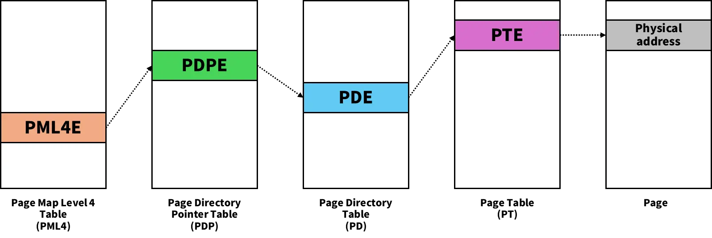
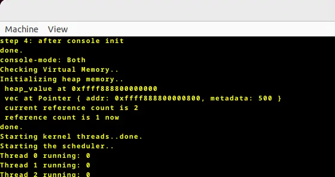

自作 OS「FerriOS」の開発日記、第二回です。前回はスケジューラとカーネルスレッドを実装し、カーネルモードでスレッドが動いている様子を確認できました。今回はユーザプロセスを実装し、カーネルスレッドと同じようにスケジューラで順次実行できる状態にしていきたいと思います。

<!--more-->

## RustでOS開発シリーズ

- #1 [スケジューラとカーネルスレッドの実装](../../../2026/02/23/rust-os-dev-1.html)
- #2 [ユーザプロセスを実装する](../../../2026/03/22/rust-os-dev-2.html)（今回）

# 今回のゴール

- ユーザプロセスを動かせるようにする

とりあえずユーザプロセスを実装して、動いていそうなところを確認するまでが今回のゴールです。システムコール実装は次回にします。

# ユーザモードの実装

ユーザプロセスを実行できるようにするために、まずはユーザモードを実装していきましょう。

現状はカーネルモードにしか対応していませんので、まずはユーザモードへの対応が必要です。

## GDT にセグメントを追加

GDT (Global Descriptor Table) に `user_code_selector` と `user_data_selector` を追加し、ユーザ空間のコードセグメントとデータセグメントに対応させていきます。

`gdt.rs`:

```rust
pub struct Selectors {
    kernel_code_selector: SegmentSelector,
    kernel_data_selector: SegmentSelector,
    pub user_code_selector: SegmentSelector,
    pub user_data_selector: SegmentSelector,
    tss_selector: SegmentSelector,
}

lazy_static! {
    pub static ref GDT: (GlobalDescriptorTable, Selectors) = {
        let mut gdt = GlobalDescriptorTable::new();
        let kernel_code_selector = gdt.add_entry(Descriptor::kernel_code_segment());
        let kernel_data_selector = gdt.add_entry(Descriptor::kernel_data_segment());
        let user_code_selector = gdt.add_entry(Descriptor::user_code_segment());
        let user_data_selector = gdt.add_entry(Descriptor::user_data_segment());
        let tss_selector = gdt.add_entry(Descriptor::tss_segment(&TSS));
        (gdt, Selectors { kernel_code_selector, kernel_data_selector, user_code_selector, user_data_selector, tss_selector })
    };
}
```

## TSS にカーネルスタックを追加

TSS (Task State Segment) の `privilege_stack_table` を確保するように変更します。このスタックはユーザモードである Ring 3 からカーネルモードである Ring 0 に遷移するときに使用されます。

`gdt.rs`:

```rust
lazy_static! {
    static ref TSS: TaskStateSegment = {
        let mut tss = TaskStateSegment::new();
        
        tss.interrupt_stack_table[DOUBLE_FAULT_IST_INDEX as usize] = {
            const STACK_SIZE: usize = 4096 * 5;
            static mut STACK: [u8; STACK_SIZE] = [0; STACK_SIZE];

            let stack_start = VirtAddr::from_ptr(&raw const STACK);
            let stack_end = stack_start + STACK_SIZE;
            stack_end
        };
        
        tss.privilege_stack_table[0] = {
            const STACK_SIZE: usize = 4096 * 5;
            static mut STACK: [u8; STACK_SIZE] = [0; STACK_SIZE];

            let stack_start = VirtAddr::from_ptr(&raw const STACK);
            let stack_end = stack_start + STACK_SIZE;
            stack_end
        };
        
        tss
    };
}
```

# ユーザプロセスの実装

前回実装した `Thread` を拡張し、ユーザプロセス用の構造体を実装していきます。

そもそもスレッドとプロセスの違いはなんぞやというと、スレッドは他のスレッドとアドレス空間を共有するタスクで、プロセスは独立したアドレス空間を保有するタスクです。プロセスは1つ以上のスレッドを持ち、1プロセスに属する各スレッドはプロセスのアドレス空間を共有します。

カーネルで動くタスクはカーネル空間を共有して動作するので「カーネルスレッド」、ユーザ向けに作成するタスクは独立したユーザ空間を持つので「ユーザプロセス」と呼び分けています。

## ファイルの整理

前回はカーネルスレッドを `thread/mod.rs` に実装していましたが、ユーザ向けの処理とごちゃ混ぜになってしまうのでファイルを分けましょう。

まず、 `thread/kthread.rs` にカーネルスレッド用の処理を移動させます。

`thread/kthread.rs`

```rust
use super::{ STACK_SIZE, THREAD_TABLE, ThreadState };

pub const NTHREAD: usize = 64;

/// カーネルスレッド作成
pub fn create_kernel_thread(entry: fn() -> !) {
    // スレッド ID を確保
    let tid = next_tid().expect("Thread table is full");

    // スタックを作成
    let stack = unsafe {
        let layout = alloc::alloc::Layout::from_size_align(STACK_SIZE, 16).unwrap();
        alloc::alloc::alloc(layout)
    };
    let stack_top = stack as u64 + STACK_SIZE as u64;

    let mut table = THREAD_TABLE.lock();
    table[tid].tid = tid;
    table[tid].state = ThreadState::Runnable;
    table[tid].kstack = stack_top;

    // コンテキストを初期化する
    table[tid].context.rsp = stack_top;
    table[tid].context.rip = entry as u64;
    table[tid].context.rflags = 0x200;  // IF (Interrupt Flag) を有効化
}

/// スレッド ID 決定
pub fn next_tid() -> Option<usize> {
    let table = THREAD_TABLE.lock();
    for i in 0..NTHREAD-1 {
        if table[i].state == ThreadState::Unused {
            return Some(i);
        }
    }
    None
}
```

`thread/mod.rs` にはカーネル・ユーザ共通の `Thread` 構造体や `ThreadState` のみを残しておきます。

`thread/mod.rs`:

```rust
use crate::scheduler;
use scheduler::context::Context;
use crate::cpu;

pub mod kthread;
pub mod uprocess;

extern crate alloc;

pub static STACK_SIZE: usize = 4096 * 4;

#[derive(Debug, Clone, Copy, PartialEq, Eq)]
pub enum ThreadState {
    ...
}

/// Process Control Block
#[derive(Debug, Clone, Copy)]
pub struct Thread {
    ...
}

impl Thread {
    pub fn new() -> Self {
        ...
    }
}

pub const NTHREAD: usize = 64;
use spin::Mutex;
use lazy_static::lazy_static;

lazy_static! {
    pub static ref THREAD_TABLE: Mutex<[Thread; NTHREAD]> = {
        Mutex::new([Thread::new(); NTHREAD])
    };
}

/// スレッド ID 決定
pub fn next_tid() -> Option<usize> {
    ...
}

/// 現在実行中のスレッドの tid を取得
pub fn current_tid() -> Option<usize> {
    ...
}
```

## ユーザプロセス構造体の実装

いよいよ、ユーザプロセスの実装です。

まずは `thread/uprocess/mod.rs` を作成し、そこに1つ以上のスレッドをメンバとして持つユーザプロセス構造体 `Process` を作成します。

`thread/uprocess/mod.rs`:

```rust
use spin::Mutex;
use x86_64::{ VirtAddr, structures::paging::{ FrameAllocator, Mapper, Page, PageTableFlags, Size4KiB } };
use lazy_static::lazy_static;

use super::{ STACK_SIZE, THREAD_TABLE, ThreadState };

mod uthread;

/// ユーザコード
pub const USER_CODE_START: u64 = 0x0000_1000_0000_0000;

/// ユーザスタック
pub const USER_STACK_TOP: u64 = 0x0000_2000_0000_0000;
pub const USER_STACK_PAGES: u64 = 4;

/// 最大プロセス数
pub const NPROCESS: usize = 16;

/// 1プロセスあたりの最大スレッド数
pub const NTHREAD_PER_PROCESS: usize = 8;

/// Process Control Block (PCB)
#[derive(Debug, Clone, Copy)]
pub struct Process {
    pub pid: usize,
    pub threads: [Option<usize>; NTHREAD_PER_PROCESS],
    pub nthread: usize,
}

impl Process {
    pub const fn new() -> Self {
        Process {
            pid: 0,
            threads: [None; NTHREAD_PER_PROCESS],
            nthread: 0,
        }
    }

    /// スレッドをプロセスに追加
    pub fn add_thread(&mut self, tid: usize) -> Result<(), &'static str> {
        if self.nthread >= NTHREAD_PER_PROCESS {
            return Err("too many threads in process");
        }
        self.threads[self.nthread] = Some(tid);
        self.nthread += 1;
        Ok(())
    }
}
```

上から説明していきます。

`USER_CODE_START`、`USER_STACK_TOP` はそれぞれユーザ空間内のコード領域、スタック領域の始点アドレスです。ここは任意のアドレスで OK ですが、コードサイズやスタックサイズは考慮しておくべきです。`USER_STACK_PAGES` は4ページ分とし、4KB分確保しておきます。

プロセス数 `NPROCESS` は最大16としています。ここは最大スレッド数 `NTHREAD = 64` 以下にしておく必要があります。1プロセスあたりの最大スレッド数 `NTHREAD_PER_PROCESS` は8としています。

`Process` 構造体はプロセス ID `pid`、スレッド番号を保持する配列 `threads[]`、スレッド数 `nthread` を持ちます。

`Process` には作成時の初期化処理 `new()` メソッドと、スレッドを追加する `add_thread()` メソッドを実装しました。


次に、この `Process` を管理しておく `PROCESS_TABLE` 配列を定義しておきます。今のところ、空き PID を取得するためだけに使用しています。

`thread/uprocess/mod.rs`:

```rust
lazy_static! {
    /// Process Table
    pub static ref PROCESS_TABLE: Mutex<[Option<Process>; NPROCESS]> = Mutex::new([None; NPROCESS]);
}
```


また、ユーザプロセス作成用のメソッドも定義しておきます。

`thread/uprocess/mod.rs`:

```rust
pub fn create_user_process(code: &[u8], mapper: &mut impl Mapper<Size4KiB>, frame_allocator: &mut impl FrameAllocator<Size4KiB>) -> Result<(), &'static str> {
    // ユーザページのフラグ
    let user_flags = PageTableFlags::PRESENT | PageTableFlags::WRITABLE | PageTableFlags::USER_ACCESSIBLE;

    // コードページ用領域を用意
    let code_page = Page::containing_address(VirtAddr::new(USER_CODE_START));
    let code_frame = frame_allocator.allocate_frame().expect("frame alloc failed");
    
    // コードページにユーザコードをコピー
    unsafe {
        mapper.map_to(code_page, code_frame, user_flags, frame_allocator).map_err(|_| "code map_to failed")?.flush();
        core::ptr::copy_nonoverlapping(code.as_ptr(), USER_CODE_START as *mut u8, code.len());
    }

    // ユーザスタック用領域を用意
    let stack_start = USER_STACK_TOP - USER_STACK_PAGES * 4096;
    for i in 0..USER_STACK_PAGES {
        let page = Page::containing_address(VirtAddr::new(stack_start + i * 4096));
        let frame = frame_allocator.allocate_frame().ok_or("frame alloc failed")?;
        unsafe {
            mapper.map_to(page, frame, user_flags, frame_allocator).map_err(|_| "stack map_to failed")?.flush();
        }
    }

    // カーネルスタックを作成
    let kstack = unsafe {
        let layout = alloc::alloc::Layout::from_size_align(STACK_SIZE, 16).unwrap();
        alloc::alloc::alloc(layout)
    };
    let kstack_top = kstack as u64 + STACK_SIZE as u64;

    // init thread を作成
    let thread = uthread::create_user_thread(kstack_top);

    // Thread Table に追加
    let tid = thread.tid;
    let mut thread_table = THREAD_TABLE.lock();
    thread_table[tid] = thread;

    // Process ID を決定
    let pid = next_pid()?;

    // Process 構造体を作成
    let mut process = Process {
        pid: pid,
        threads: [None; 8],
        nthread: 1,
    };
    process.add_thread(tid)?;

    // Process Table に追加
    let mut process_table = PROCESS_TABLE.lock();
    process_table[pid] = Some(process);

    Ok(())
}
```

ここではコード領域用のページを用意し、コード領域にマップします。その後、ユーザで動かす機械語コードを受け取り、それをユーザ空間内のコード領域にコピーします。

次にスタック領域用のページを用意し、スタック領域にマップします。

カーネルに戻った時用にカーネル側のスタックも必要なので、そちらも用意しておきます。

init thread と書いてあるように、ユーザプロセス内の最初のユーザスレッドを後に実装する `uthread::create_user_thread()` で生成しておき、カーネルスレッドと同じように Thread Table に登録します。

`next_pid()` で空き PID を取得し、ようやく `Process` 構造体が作成可能になります。作成した `Process` 構造体は `PROCESS_TABLE` に追加します。

`next_pid()` では `PROCESS_TABLE` を走査し、空いている最小の PID を取得します。

`thread/uprocess.rs`:

```rust
fn next_pid() -> Result<usize, &'static str> {
    let table = PROCESS_TABLE.lock();
    for i in 0..NPROCESS-1 {
        if table[i].is_none() {
            return Ok(i);
        }
    }
    Err("Process table is full")
}
```

ユーザスレッドについては、見やすいように別のファイル `thread/uprocess/uthread.rs` に実装しました。

`thread/uprocess/uthread.rs`:

```rust
use super::{ THREAD_TABLE, USER_STACK_TOP, USER_CODE_START, ThreadState };
use crate::{gdt, thread::Thread};

pub fn create_user_thread(kstack_top: u64) -> Thread {
    // スレッド ID を確保
    let tid = super::super::next_tid().expect("Thread table is full");

    // スレッドテーブルに追加
    let mut thread = Thread::new();
    thread.tid = tid;
    thread.state = ThreadState::Runnable;
    thread.kstack = kstack_top;

    // コンテキストを初期化する
    thread.context.rsp = kstack_top;
    thread.context.rip = ring3_entry_trampoline as u64;
    thread.context.rflags = 0x200;  // IF (Interrupt Flag) を有効化
    thread.context.cs = gdt::GDT.1.user_code_selector.0 as u64;
    thread.context.ss = gdt::GDT.1.user_data_selector.0 as u64;
    thread.context.rsp3 = USER_STACK_TOP;

    thread
}
```

実行内容はカーネルスレッド作成とほぼ同じですが、カーネルスレッド生成時の処理に加えて、CS レジスタ、SS レジスタ、RSP3 レジスタ用のコンテキストも初期化しています。

`ring3_entry_trampoline()` を RIP レジスタに登録しておき、ここをユーザスレッドのエントリポイントとしています。ここでコンテキストに登録した各値をレジスタに設定しています。

`thread/uprocess/uthread.rs`:

```rust
unsafe extern "C" fn ring3_entry_trampoline() -> ! {
    let (cs, ss, rsp3, rip) = {
        let table = THREAD_TABLE.lock();
        let ctx =&table[super::super::current_tid().expect("No running thread")].context;
        (ctx.cs, ctx.ss, ctx.rsp3, USER_CODE_START)
    };

    unsafe {
        core::arch::asm!(
            "mov ds, ax",
            "mov es, ax",
            "push rax",
            "push {rsp3}",
            "push {rflags}",
            "push {cs}",
            "push {rip}",
            "iretq",            // switch: cs, ss, rsp, rflags
            inout("ax") ss => _,
            cs = in(reg) cs,
            rsp3 = in(reg) rsp3,
            rflags = in(reg) 0x202u64,
            rip = in(reg) rip,
        );
    }

    loop {}
}
```

## ユーザ空間用ページテーブルの用意

今のままではユーザプロセスがカーネル空間にアクセスできてしまいますので、それは避けなければなりません。

というわけでユーザ空間用のページテーブルを作成し、そちらに切り替えてユーザプロセスを実行させます。

まずはユーザプロセス作成用の関数を定義します。

`memory.rs`:

```rust
/// ユーザ用ページテーブルを作成する
/// カーネル領域は現在（カーネル）のページテーブルからコピーする
pub unsafe fn create_user_page_table(frame_allocator: &mut impl FrameAllocator<Size4KiB>, physical_memory_offset: VirtAddr) -> Option<(OffsetPageTable<'static>, PhysFrame)> {
    // 新しい level-4 フレームを allocate
    let new_frame = frame_allocator.allocate_frame()?;

    // 新しいページテーブルを初期化
    let new_table_va = physical_memory_offset + new_frame.start_address().as_u64();
    let new_table_ptr: *mut PageTable = new_table_va.as_mut_ptr();
    unsafe {
        new_table_ptr.write(PageTable::new());
    }

    // カーネル用領域 をコピー
    let (current_frame, _) = x86_64::registers::control::Cr3::read();
    let current_va = physical_memory_offset + current_frame.start_address().as_u64();
    let current_table_ptr: *const PageTable = current_va.as_ptr();
    let current_table = unsafe {
        &*current_table_ptr
    };
    let new_table = unsafe {
        &mut *new_table_ptr
    };
	
    // カーネル空間をコピー
    for i in 256..512 {
        new_table[i] = current_table[i].clone();
    }

    // ユーザ空間のエントリのみクリア
    let user_code_l4_index = (crate::thread::uprocess::USER_CODE_START >> 39) as usize & 0x1FF;   // 32
    let user_stack_l4_index = (crate::thread::uprocess::USER_STACK_TOP >> 39) as usize & 0x1FF;   // 64
    new_table[user_code_l4_index].set_unused();
    new_table[user_stack_l4_index].set_unused();

    let new_page_table = unsafe {
        OffsetPageTable::new(&mut *new_table_ptr, physical_memory_offset)
    };

    Some((new_page_table, new_frame))
}
```

ここではユーザページテーブルを作成する先の物理アドレスを引数で受け取り、まずは空のページテーブルを用意します。

そして、カーネル空間内の PML4 エントリをマップしていきます。これは、ユーザプロセスがシステムコールを発行したりコンテキストスイッチを行うときに、カーネルモードでカーネルのメモリオブジェクトにアクセスできるようにするためです。Intel アーキテクチャの 4-level paging の場合、ページは4次元配列のような形で4レベルのディレクトリ構成で管理されていて、PML4 (Page Map Level 4) Table は最上位にあたります。



近年はセキュリティ上の理由（主に Meltdown 脆弱性対策）から、カーネル空間とユーザ空間を別々のページテーブルに分離した KPTI (Kernel Page-Table Isolation) が一般的ですが、今回はそこまで考慮していないので、とりあえず従来通りユーザ用のページテーブルにもカーネル空間をマップしていきます。

作成したユーザプロセス用ページテーブルは `Process` 構造体に持たせておきます。

`thread/uprocess.rs`:

```rust
pub fn create_user_process(code: &[u8], mapper: &mut impl Mapper<Size4KiB>, frame_allocator: &mut impl FrameAllocator<Size4KiB>) -> Result<(), &'static str> {
    // ユーザページのフラグ
    let user_flags = PageTableFlags::PRESENT | PageTableFlags::WRITABLE | PageTableFlags::USER_ACCESSIBLE;

    // ユーザページテーブルを作成
    let physical_memory_offset = memory::PHYSICAL_MEMORY_OFFSET.lock().expect("physical memory offset not initialized");
    let (mut user_mapper, page_table) = unsafe {
        memory::create_user_page_table(frame_allocator, physical_memory_offset)
    }.ok_or("failed to allocate page table frame")?;
    ...
    // Process 構造体を作成
    let mut process = Process {
        pid: pid,
        threads: [None; 8],
        nthread: 1,
        page_table: Some(page_table),
    };
    process.add_thread(tid)?;

    // Process Table に追加
    let mut process_table = PROCESS_TABLE.lock();
    process_table[pid] = Some(process);

    Ok(())
}
```

## ユーザ/カーネル ページテーブル切り替えの実装

次に、カーネルページテーブル、ユーザページテーブルそれぞれに切り替える用の関数を用意します。まずはカーネル空間用から。

`memory.rs`:

```rust
/// カーネルページテーブルに切り替え
pub unsafe fn switch_to_kernel_page_table() {
    let kernel_frame = KERNEL_PAGE_TABLE_FRAME.lock();
    if let Some(frame) = *kernel_frame {
        unsafe {
            x86_64::registers::control::Cr3::write(frame, Cr3Flags::empty());
        }
    }
}
```

ここでは、 `x86_64::registers::control::Cr3::write()` を呼び出して CR3 レジスタにページテーブルフレームのアドレスを書き込んでいます。CR3 レジスタは MMU が参照すべきページテーブルを設定するレジスタです。

つづいてユーザ空間用。こちらも同様の処理が入りますが、ユーザプロセスごとに切り替え先が異なるので、スレッド構造体 `Thread` を受け取って、そこからユーザプロセスのページテーブルを取得し切り替えます。

`memory.rs`:

```rust
/// ユーザプロセスのページテーブルに切り替え
pub unsafe fn switch_to_user_page_table(thread: &thread::Thread) {
    if let Some(pid) = thread.pid {
        let process_table = thread::uprocess::PROCESS_TABLE.lock();
        let process = &process_table[pid].expect("this process does not have page table yet");
        let page_table = process.page_table.expect("this process is not in the process_table");

        unsafe {
            x86_64::registers::control::Cr3::write(page_table, x86_64::registers::control::Cr3Flags::empty());
        }
    }
    else {
        panic!("this process does not have pid");
    }
}
```


最後に、ページテーブル切り替えをスケジューラから呼び出します。

`scheduler/round_robin.rs`:

```rust
impl super::Scheduler for RoundRobin {
    ...
                    Some(next_tid) => {
                    let (old_context, new_context) = {
                        // スレッド状態を更新
                        table[next_tid].state = ThreadState::Running;
                        if let Some(current_tid) = cpu.current_tid {
                            if table[current_tid].state == ThreadState::Running {
                                table[current_tid].state = ThreadState::Runnable;
                            }
                        }
                        
                        // CPU で実行中のスレッド ID を更新
                        cpu.current_tid = Some(next_tid);
                        
                        // CR3 page table switch
                        if table[next_tid].pid.is_some() {
                            // ユーザスレッドの場合：プロセスのユーザページテーブルに切り替え
                            unsafe {
                                memory::switch_to_user_page_table(&table[next_tid]);
                            }
                        }
                        else {
                            // カーネルスレッドの場合：カーネルページテーブルに切り替え
                            unsafe {
                                memory::switch_to_kernel_page_table();
                            }
                        }
                        
                        let old_context = &mut cpu.scheduler as *mut Context;
                        let new_context = &table[next_tid].context as *const Context;

                        drop(cpu);
                        drop(table);

                        (old_context, new_context)
                    };
                    
                    unsafe {
                        switch_context(old_context, new_context);
                    }
    ...
}
```

## ここで問題…

これでうまくいくはず！…と踏んでいたのですが、ページフォルトが発生。

```bash
EXCEPTION: PAGE FAULT
Accessed Address: VirtAddr(0x100000000000)
Error Code: PageFaultErrorCode(USER_MODE | INSTRUCTION_FETCH)
InterruptStackFrame {
    instruction_pointer: VirtAddr(
        0x100000000000,
    ),
    code_segment: 27,
    cpu_flags: 0x202,
    stack_pointer: VirtAddr(
        0x200000000000,
    ),
    stack_segment: 35,
}
```

デバッグを続けると、カーネル領域が [0]～[255] にマップされているっぽいことを確認しました。

```bash
Starting kernel threads..done.
entry[0]: current=0x2000 new=0x2000
entry[2]: current=0x4ec000 new=0x4ec000
entry[3]: current=0x4f4000 new=0x4f4000
entry[31]: current=0x4f0000 new=0x4f0000
entry[136]: current=0x288000 new=0x288000
Starting the scheduler..
```

現時点ではユーザプロセス用のページを確保するメソッドを用意していませんが、将来的にユーザプロセス用にページを作成するとなったとき、ユーザとカーネルの PML4 エントリが混在する状況は避けるべきです。そうしないと、どれがカーネル用の PML4 エントリでどれがユーザ用の PML4 エントリかの判別がつかなくなり、どの PML4 エントリをユーザプロセスのページテーブルにマップするべきかが分からなくなるからです。

xv6 などでは、PML4 テーブルのうち前半のエントリはユーザ用で後半はカーネル用、といった形に分けています。今回は xv6 に倣って PML4 の後半 [256]～[511] にカーネル領域をマップされるようにしましょう。つまり、前半 [0]～[255] はユーザ空間用に空けておくべきです。

ただ、カーネルスタックやカーネルコードが PML4 エントリのどこにマップされるかについては、どうやらブートローダ側が自動で決定しているらしく…。FerriOS のブートローダは `bootloader` crate ([GitHub](https://github.com/rust-osdev/bootloader){:target="_blank"}) に丸投げしているのですが、ドキュメントを探した限り、すくなくとも現在使用している bootloader v0.9 にはカーネルスタックやカーネルコードなどのカーネル領域のマップ先の指定に関するオプションが見つかりませんでした。（読み飛ばしただけかもしれませんが…）

正確に言えば、カーネルスタックアドレスのオフセットは指定できるのです。ただ、カーネルコード領域のオフセットを指定するオプションが見つかりませんでした。

```toml
[package.metadata.bootloader]
kernel-stack-address = "0xFFFFFF8000000000"
physical-memory-offset = "0xFFFF800000000000"
```

## bootloader を v0.11 にする

`bootloader` v0.11 にはカーネルコード領域を始めとする各エントリのオフセットを指定するオプションが追加されているようです。というわけでこちらに切り替えました。

```rust
static BOOTLOADER_CONFIG: BootloaderConfig = {
    let mut config = BootloaderConfig::new_default();
    config.mappings.physical_memory = Some(Mapping::FixedAddress(0xFFFF_A000_0000_0000)); // index 308
    config.mappings.kernel_base = Mapping::FixedAddress(0xFFFF_8000_0000_0000);           // index 256
    config.mappings.kernel_stack = Mapping::FixedAddress(0xFFFF_9000_0000_0000);          // index 288
    config.mappings.framebuffer = Mapping::FixedAddress(0xFFFF_B000_0000_0000);           // index 324
    config.mappings.boot_info = Mapping::FixedAddress(0xFFFF_C000_0000_0000); 
    config
};

entry_point!(kernel_main, config = &BOOTLOADER_CONFIG);
```

ただ、v0.9 と v0.11 の間には**数々の破壊的な仕様変更**が入っており、移行作業は容易ではありません。v0.9 から v0.11 に移行するうえでの注意点やヒントなどについては公式のリポジトリにドキュメントとして公開されています。

- [https://github.com/rust-osdev/bootloader/blob/v0.11.15/docs/migration/v0.9.md](https://github.com/rust-osdev/bootloader/blob/v0.11.15/docs/migration/v0.9.md)

実はこの移行作業で一ヶ月くらい奮闘していたので、もはやどこからどこまでを修正したのか分からなくなっており（適当な開発ですみません）、ここから先の説明は少し雑になってしまいますがご了承ください。

思いつく限りで移行作業の過程で修正した点：

- ビルドシステム

  - [bootloader v0.11 の推奨構成](https://docs.rs/crate/bootloader/0.11.15/source/README.md)では、カーネルコードは `kernel/` ディレクトリに移動してサブクレートとし、ルートディレクトリにはイメージビルド用のクレートを定義するというワークスペース方式に切り替わっているようです。つまり、こんな構成になります：

    ```
    ferrios/
    ├── Cargo.toml          ← ワークスペース定義 + os クレート (build-dep に bootloader)
    ├── Cargo.lock
    ├── build.rs            ← bios.img を生成
    ├── src/
    │   └── main.rs         ← cargo run で QEMU を起動
    ├── .cargo/
    │   └── config.toml
    ├── rust-toolchain.toml
    └── kernel/             ← カーネル本体（元々の src/ を移動）
        ├── Cargo.toml      ← bootloader_api を依存
        ├── src/
        └── .cargo/
            └── config.toml
    ```

  - これだけでも如何にめんどくさいか分かるでしょう…

- シンボル名の修正

  - bootloader v0.11 では、ブートローダ本体は `bootloader` に、カーネル側が依存する実装は `bootloader_api` に分離されました。つまり、 `use` などで定義しているシンボル名を従来の `bootloader` から、一部は `bootloader_api` に変更する必要があります。

- ブートローダ設定 (`BootloaderConfig`) の定義

  - v0.9 では `entry_point!()` マクロでエントリポイントを定義していましたが、v0.11 では `entry_point!()` にエントリポイントだけでなく、ブートローダ設定も渡す必要があります。これによってカーネルコード領域のアドレスなど、様々な設定を定義可能になりました。
    ```rust
    static BOOTLOADER_CONFIG: BootloaderConfig = {
        let mut config = BootloaderConfig::new_default();
        config.mappings.physical_memory = Some(Mapping::FixedAddress(0xFFFF_A000_0000_0000)); // index 308
        config.mappings.kernel_base = Mapping::FixedAddress(0xFFFF_8000_0000_0000);           // index 256
        config.mappings.kernel_stack = Mapping::FixedAddress(0xFFFF_9000_0000_0000);          // index 288
        config.mappings.framebuffer = Mapping::FixedAddress(0xFFFF_B000_0000_0000);           // index 324
        config.mappings.boot_info = Mapping::FixedAddress(0xFFFF_C000_0000_0000); 
        config
    };
    
    entry_point!(kernel_main, config = &BOOTLOADER_CONFIG);
    ```

- VGA text mode から frame buffer への移行

  - v0.9 では VGA text mode でテキスト出力を比較的簡単に実装できていましたが、v0.11 では frame buffer を使ってくださいとのことです。つまり、フォントのビットマップデータを埋め込んでおき、frame buffer にピクセル単位で描画する必要があります。公式のサンプルは[こちら](https://github.com/rust-osdev/bootloader/blob/main/common/src/framebuffer.rs)にあります。
  - これもかなり面倒くさい！ですが、好みのフォントを埋め込めるという利点もあります。今回、FerriOS には noto-sans ([noto-sans-mono-bitmap](https://crates.io/crates/noto-sans-mono-bitmap)) を埋め込んでみました。
  - たぶん GUI の実装も同じ要領でできそう。ゆくゆくは GUI も実装したいですね。

移行作業でかなりのコードを修正したのですが、ひとつひとつ解説するのは正直骨が折れます。こちらに GitHub で比較して修正前後の diff の URL を載せておきますので、ご興味があれば御覧ください。

- [https://github.com/yotiosoft/FerriOS/compare/dc569db..b3cb826](https://github.com/yotiosoft/FerriOS/compare/dc569db..b3cb826)

### frame buffer への対応

一つだけ解説しがいがありそうなのは frame buffer への対応です。bootloader v0.11 への移行の過程で、VGA text mode の代わりとして実装しました。

結局ここのコードは[公式のサンプル](https://github.com/rust-osdev/bootloader/blob/main/common/src/framebuffer.rs)をパクっ…参考にして作ったものなのですが（あ、元のコードは MIT ライセンスですよ）、ピクセル単位で frame buffer に文字を書き込んでいくという操作を実装しています。

`console/framebuffer.rs`:

```rust
// Refer to: https://github.com/rust-osdev/bootloader/blob/1d4166141c22c9aaab0136f20305a26093c9a981/common/src/framebuffer.rs

use bootloader_api::info::{FrameBufferInfo, PixelFormat};
use noto_sans_mono_bitmap::{get_raster, FontWeight, RasterHeight};

/// フォントの設定
const FONT_WEIGHT: FontWeight = FontWeight::Bold;
const RASTER_HEIGHT: RasterHeight = RasterHeight::Size16;
const CHAR_WIDTH: usize = 8;
const LINE_HEIGHT: usize = 16;

pub struct FrameBufferWriter {
    buffer: &'static mut [u8],
    info: FrameBufferInfo,
    pub x_pos: usize,
    pub y_pos: usize,
    pub color: [u8; 3],
    pub weight: FontWeight,
}

impl FrameBufferWriter {
    pub fn new(buffer: &'static mut [u8], info: FrameBufferInfo) -> Self {
        Self {
            buffer,
            info,
            x_pos: 0,
            y_pos: 0,
            color: [255, 255, 0],
            weight: FONT_WEIGHT,
        }
    }

    pub fn buffer_mut(&mut self) -> &mut [u8] {
        self.buffer
    }

    fn newline(&mut self) {
        self.x_pos = 0;
        self.y_pos += LINE_HEIGHT;
    }

    pub fn clear(&mut self) {
        self.x_pos = 0;
        self.y_pos = 0;
        self.buffer.fill(0);
    }

    pub fn write_char(&mut self, c: char) {
        match c {
            '\n' => self.newline(),
            c => {
                if self.x_pos + CHAR_WIDTH > self.info.width {
                    self.newline();
                }
                
                self.draw_char(c);
                self.x_pos += CHAR_WIDTH;
            }
        }
    }

    fn draw_char(&mut self, c: char) {
        let char_raster = get_raster(c, self.weight, RASTER_HEIGHT)
            .unwrap_or_else(|| get_raster(' ', self.weight, RASTER_HEIGHT).unwrap());

        for (y, row) in char_raster.raster().iter().enumerate() {
            for (x, intensity) in row.iter().enumerate() {
                self.write_pixel(self.x_pos + x, self.y_pos + y, *intensity);
            }
        }
    }

    fn write_pixel(&mut self, x: usize, y: usize, intensity: u8) {
        let pixel_offset = y * self.info.stride + x;
        let r = (self.color[0] as u16 * intensity as u16 / 255) as u8;
        let g = (self.color[1] as u16 * intensity as u16 / 255) as u8;
        let b = (self.color[2] as u16 * intensity as u16 / 255) as u8;

        let color_bytes = match self.info.pixel_format {
            PixelFormat::Rgb => [r, g, b, 0],
            PixelFormat::Bgr => [b, g, r, 0],
            PixelFormat::U8 => [intensity, 0, 0, 0],
            _ => [r, g, b, 0],
        };

        let bytes_per_pixel = self.info.bytes_per_pixel;
        let byte_offset = pixel_offset * bytes_per_pixel;
        
        if byte_offset + bytes_per_pixel <= self.buffer.len() {
            self.buffer[byte_offset..(byte_offset + bytes_per_pixel)]
                .copy_from_slice(&color_bytes[..bytes_per_pixel]);
        }
    }
}
```

`draw_char()` で文字のラスタデータを読み込むときに、 `noto_sans_mono_bitmap` クレートから noto-sans フォントのラスタデータを渡すようにしています。結果として、FerriOS は QEMU 上に Noto Sans フォントを表示するようになります。



## カーネル空間を PML4 の [256]～[511] にマップさせる

話が逸れてしまいましたが、bootloader v0.11 に移行したのはこれを実現するためです。

`entry_point!()` で渡す `BootloaderConfig` を下記のように定義します。

```rust
static BOOTLOADER_CONFIG: BootloaderConfig = {
    let mut config = BootloaderConfig::new_default();
    config.mappings.physical_memory = Some(Mapping::FixedAddress(0xFFFF_A000_0000_0000)); // index 308
    config.mappings.kernel_base = Mapping::FixedAddress(0xFFFF_8000_0000_0000);           // index 256
    config.mappings.kernel_stack = Mapping::FixedAddress(0xFFFF_9000_0000_0000);          // index 288
    config.mappings.framebuffer = Mapping::FixedAddress(0xFFFF_B000_0000_0000);           // index 324
    config.mappings.boot_info = Mapping::FixedAddress(0xFFFF_C000_0000_0000); 
    config
};

entry_point!(kernel_main, config = &BOOTLOADER_CONFIG);
```

カーネルが利用する領域の PML4 エントリはいずれも 256 以降になるようにしています。

結果：

```bash
Starting kernel threads..done.
entry[0]: current=0x107f000 new=0x0
entry[256]: current=0x1047000 new=0x1047000
entry[273]: current=0x1000 new=0x1000
entry[288]: current=0x1069000 new=0x1069000
entry[320]: current=0x1088000 new=0x1088000
entry[352]: current=0x1084000 new=0x1084000
entry[384]: current=0x108e000 new=0x108e000
Starting the scheduler..
```

entry[0] が残っていますが、これは GDT なのでマップしなくても問題はないでしょう。というわけで、カーネル空間の [256]～[511] だけマップすればユーザプロセスが動くようになりました。

（これがしたいだけなのに、かなり遠回りしたような気も…）

## ユーザプログラムを動かす

まだシステムコールを実装していないので、文字を表示させたりはできませんが、とりあえず何らかのスレッドを動かしてみます。

ELF ファイルにも対応していないので、一旦ユーザプログラムはハードコーディングで記述します。ここでは単に RAX レジスタを初期化し、インクリメントしてループさせているだけです。

`main.rs`:

```rust
/// エントリポイント
fn kernel_main(boot_info: &'static BootInfo) -> ! {
    ...
    // ユーザプロセス作成
    const USER_CODE: &[u8] = &[
        0x48, 0x31, 0xC0,           // xor rax, rax
        0x48, 0xFF, 0xC0,           // inc rax
        0xEB, 0xFB,                 // jmp -5
    ];

    thread::uprocess::create_user_process(USER_CODE, &mut mapper, &mut frame_allocator).expect("failed to create user process");
    
    println!("Starting the scheduler..");
    scheduler::scheduler();
}
```

ただ、現状ユーザプロセスが動いていることをユーザプログラム側からデバッグ出力する術がないので、とりあえずタイマ割り込み発生時に、ユーザプロセスであれば RIP の実行アドレスを表示するように修正してみます。

`interrupts.rs`:

```rust
/// タイマ割り込みハンドラ
extern "x86-interrupt" fn timer_interrupt_handler(stack_frame: InterruptStackFrame) {
    unsafe {
        PICS.lock().notify_end_of_interrupt(InterruptIndex::Timer.as_u8());
    }

    // CS の下位2ビットが CPL（現在の特権レベル）
    let cpl = stack_frame.code_segment & 0b11;
    if cpl == 3 {
        println!("Ring 3 confirmed! rip={:#x}", stack_frame.instruction_pointer);
    }

    unsafe {
        if scheduler::SCHEDULER_STARTED {
            scheduler::yield_from_context();
        }
    }
}
```


とりあえず、なんとなく動いていてループできてそうだなぁと言うところまで確認できました。

# おわりに

今回はここまで。ユーザプログラムを動かして、なんとなく動いていそうな様子を確認しました。思いがけぬ bootloader の最新版へのアップデートで手間取りましたが、frame buffer 実装によってよりグラフィック出力の自由度が上がりました。

ただ、まだシステムコールを実装していないので、ユーザプログラムのデバッグができません…。次回はシステムコールを実装して、ユーザプログラムから文字出力できるようにしたいと思います。
